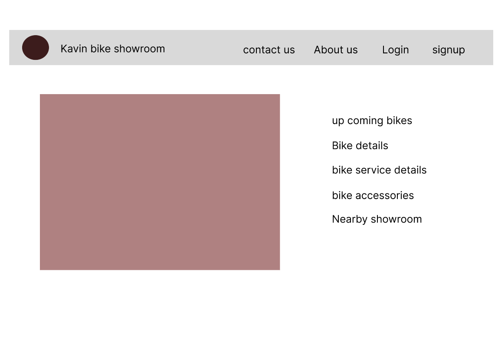
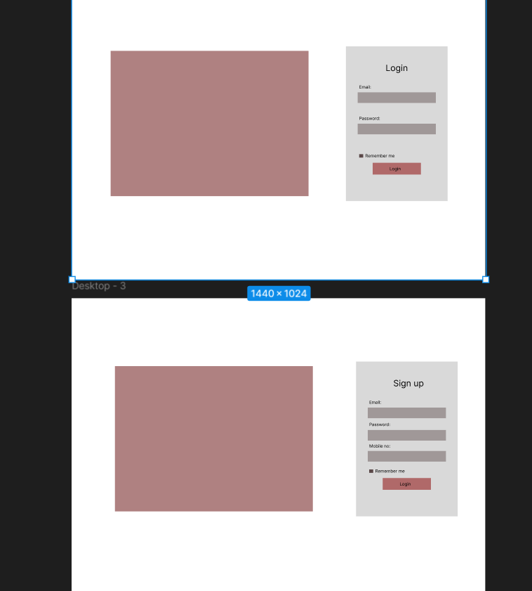

 # Project
 # Bike Showroom Management System

## Description
The **Bike Showroom Management System** is a web application that helps manage bike inventory, sales, customer records, and service bookings efficiently. It is built using **Node.js, Express.js, MongoDB**, and a frontend framework like **React.js**.

## Features
- Add, update, and delete bike details
- Manage customer records
- Handle sales and purchase transactions
- Maintain service booking details
- User authentication and authorization
- Generate reports for sales and inventory

## Tech Stack
- **Backend:** Node.js, Express.js
- **Database:** MongoDB
- **Frontend:** React.js (optional)
- **Authentication:** JWT (JSON Web Token)

## Installation
### Prerequisites
Ensure you have the following installed:
- Node.js (>=14.x)
- MongoDB (>=4.x)

### Steps to Set Up
1. Clone the repository:
   ```bash
   git clone https://github.com/yourusername/bike-showroom-management.git
   cd bike-showroom-management
   ```
2. Install dependencies:
   ```bash
   npm install
   ```
3. Set up environment variables in `.env` file:
   ```env
   MONGO_URI=mongodb://localhost:27017/bike_showroom
   JWT_SECRET=your_jwt_secret
   PORT=5000
   ```
4. Start MongoDB server (if not running):
   ```bash
   mongod
   ```
5. Run the application:
   ```bash
   npm start
   ```
6. Open the browser and visit `http://localhost:5000`

## API Endpoints
| Method | Endpoint               | Description              |
|--------|------------------------|--------------------------|
| GET    | /api/bikes             | Get all bikes            |
| POST   | /api/bikes             | Add a new bike           |
| GET    | /api/bikes/:id         | Get bike by ID           |
| PUT    | /api/bikes/:id         | Update bike details      |
| DELETE | /api/bikes/:id         | Delete a bike            |
| GET    | /api/customers         | Get all customers        |
| POST   | /api/customers         | Add a new customer       |
| GET    | /api/customers/:id     | Get customer by ID       |
| PUT    | /api/customers/:id     | Update customer details  |
| DELETE | /api/customers/:id     | Delete a customer        |
| POST   | /api/auth/register     | User Registration        |
| POST   | /api/auth/login        | User Login               |

## License
This project is licensed under the MIT License.

## Contributors
- [Your Name](https://github.com/yourusername)

## Contact
For any queries, feel free to reach out at `your-email@example.com`.

## image

